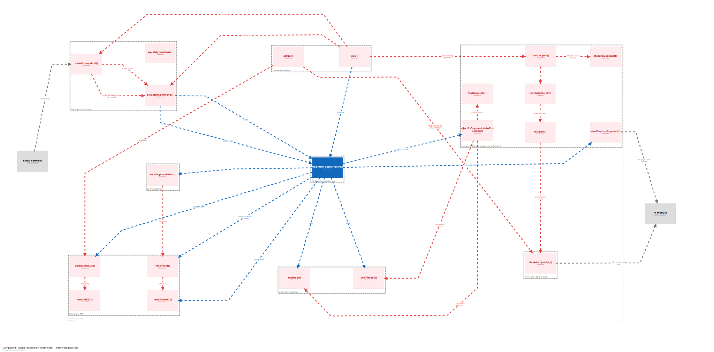

# Evolutionary-Computation on Pololu 3pi+ 32U4

下面是**基于你当前仓库结构**的精简英文版 README（可直接整段粘贴到 `README.md`）。我已按你实际的文件夹命名填好（GA/DE 共用框架 + 图在 `docs/`）：

---

# Thesis Code: Evolutionary Control on Pololu 3pi+ 32U4

**Thesis snapshot:** `v1.0-thesis`

Two Arduino firmwares for the Pololu **3pi+ 32U4** robot, plus simple host-side scripts.
**GA** and **DE** share the same firmware framework (I/O, runtime loop, logging); only the core optimizer differs.

This is the evolutionary computation island model framework, with the blue part representing replaceable algorithm modules driven by FSM

## Contents

* **DE island/** — Differential Evolution firmware

  * `DE_recordingver.ino`, `ircomm_i2c.h`
* **GA island/** — Genetic Algorithm firmware

  * `GAr_recordingver.ino`, `ircomm_i2c.h`
* **MATLAB data recording script/** — `datarecord.m` (automates runs & logs serial CSV)
* **Plot script/** — `Plot.ipynb` (basic plotting)
* **Statistical testing/** — `Statistical_testing.ipynb` (basic statistical tests)
* **Data/** — place collected CSV here (raw/processed as you prefer)
* **docs/** — diagrams (`structurizr-1-c3-all.svg`, `structurizr-1-c3-all-key.svg`)

## Usage

*Add concrete flashing steps, ports, parameters, and run commands here.*

